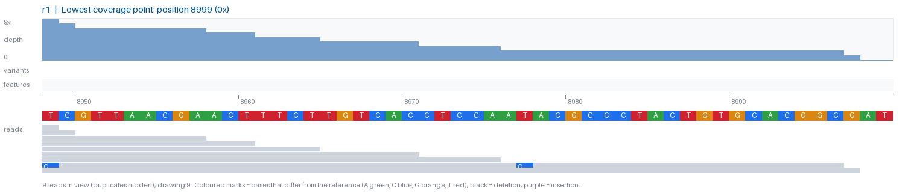

# BAM Snapshot

Headless, cross-platform batch snapshots of BAM alignments. No display or
external tools needed — just Python. Runs the same on Windows, Mac and Linux,
and processes BAMs in parallel.




## Layout

A parent folder with one subfolder per sample:

```
main_dir/
  sample1/
    reference.fa     any .fa/.fasta (names containing "_clean" are ignored); first sequence is plotted
    BAM/*.bam        .bai index optional
    *.gbk            optional - annotated map, drawn as the "features" track
    **/*.vcf         optional - variant calls (VarScan-style), drawn as the "variants" track
```

If no VCF is found, variants are called from the BAM itself (default: ≥5% of
reads, ≥2 reads, depth ≥10; change with `--min-var-freq`). Missing GenBank file
just means an empty features track.

## Output

In `<sample>/Snapshots/`, for each BAM:

- `<bam>_overview.png` — whole plasmid: coverage, variants, features, read stack.
  Mismatches are only coloured at variant positions so sequencing noise doesn't clutter it.
- `<bam>_zoom_<n>.png` — base-level views around the highest-frequency variants
  (≥20%), or the lowest-coverage spot if there are none.

Duplicate, secondary and supplementary reads are hidden.

## Usage

```bash
pip install -r requirements.txt
python bam_snapshots.py /path/to/main/directory
```

| Flag | Default | Meaning |
|---|---|---|
| `--max-zoom` | 3 | zoom PNGs per BAM |
| `--zoom-window` | 100 | bp shown in each zoom |
| `--max-reads` | 6000 | reads drawn in the overview (coverage always uses all reads) |
| `--min-bq` | 20 | ignore mismatches below this base quality |
| `--min-var-freq` | 0.05 | threshold for BAM-called variants (only used without a VCF) |
| `--jobs` | CPU count | parallel processes, one BAM each |

`pysam` is used automatically if installed (faster, Mac/Linux); otherwise the
pure-Python `bamnostic` is used, which needs no compiler and works on Windows.
