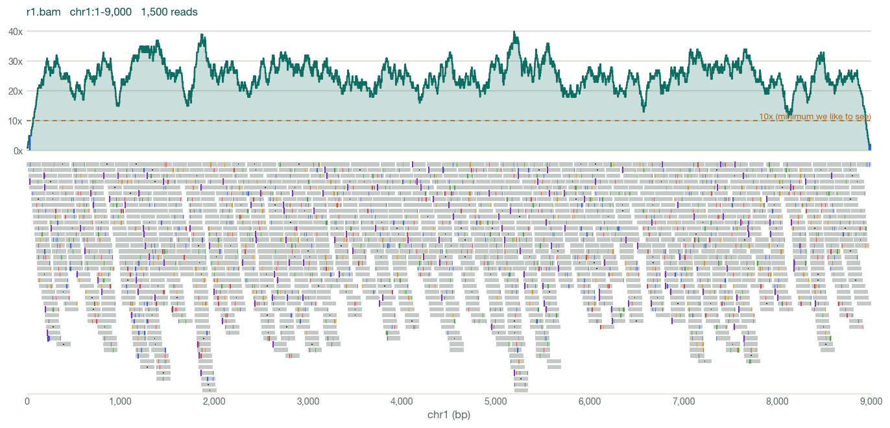

# BAM Snapshot

Headless, cross-platform batch snapshots of BAM alignments. No display or
Java needed — just Python and matplotlib. Runs the same on Windows, Mac and
Linux.



Each PNG shows a coverage track with a dashed 10x minimum-depth line (bases differing from the reference in ≥20% of
reads are coloured) above a packed read pileup: reads as grey bars,
mismatches coloured by base, deletions as black bars,
insertions as purple ticks.

## Layout

A parent folder with one subfolder per sample, each containing a reference
fasta (any `.fa`/`.fasta`, ignoring names containing `_clean`) and a `BAM/`
subfolder (`.bai` index optional). Snapshots go to `<sample>/Snapshots/`.
The first sequence in the fasta is plotted.

## Usage

```bash
pip install -r requirements.txt
python bam_snapshots.py /path/to/main/directory
```

Options:

| Flag | Default | Meaning |
|---|---|---|
| `--region START-END` | whole contig | 1-based window on the first contig |
| `--width` / `--dpi` | 14 / 120 | figure size |
| `--max-reads` | 2000 | reads drawn (coverage always uses all reads) |
| `--max-rows` | 80 | max stacked read rows |
| `--jobs` | CPU count | parallel processes, one BAM each |

`pysam` is used automatically if installed (faster); otherwise the
pure-Python `bamnostic` is used, which needs no compiler and works on Windows.
